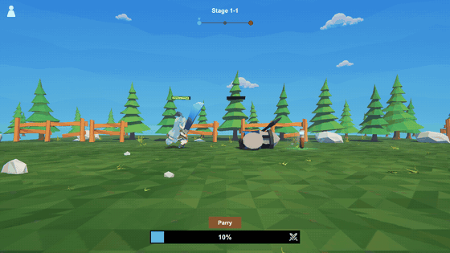

# Re:tima

Action Idle RPG · Unity 6 (URP) · C#

▶︎ **[브라우저에서 바로 플레이](https://ksg76.itch.io/re-tima)**

메이플스토리 울티마 스쿼드를 참고하여 만든 직접 조작 전투(패링)를 결합한 방치형 RPG입니다.

이 저장소는 게임플레이 프로그래밍 스코프를 확인할 수 있도록 `Assets/Scripts` 소스코드만 포함합니다.

## 폴더 구조

- `Combat/` — 전투 루프, 플레이어/몬스터, 패링, 궁극기
- `Progression/` — 드롭 타입(스탯/장비)과 그 조율
- `Stage/` — 스테이지 진행, 몬스터 스폰, 드롭 픽업, 배경 스크롤·낮밤 연출
- `Data/` — 전투/드롭 수치와 몬스터 정의(ScriptableObject), 등급 롤과 등급별 색·크기 램프
- `UI/` — HUD, 관리창, 배너/게이지, 팝업, 타이틀·종료 화면
- `Core/` — 이벤트 버스(`GameEvents`)
- `Debug/` — 개발용 디버그 도구

## 동작 과정

1. 플레이 버튼 클릭 시 `TitleScreenView.HandlePlayPressed()`가 실행됨
- 내부의 `onPlay?.Invoke()`가 `onPlay`에 보관된 `StageManager.BeginRun()`을 실행
2. `StageManager.ShowBannerThenSpawn()`이 `banner.Show()`로 스테이지 배너를 잠깐 보여주고, 배너가 닫힌 뒤 `SpawnForCurrentSubStage()`로 몬스터를 소환해 자동 이동시킴
- `MonsterSpawner.Spawn()`: SO 데이터 반환 → 스탯 계산 → 화면 밖 프리팹 생성 → 스탯 주입 → 이동 → 이벤트 발생
3. 씬 로드 시점부터 `CombatLoop.Update()`가 매 프레임 `shouldBeMoving`을 세팅하고, `true`면 플레이어가 제자리 달리기 애니메이션을 계속 재생
- 배경과 바닥이 스크롤돼서 전진하는 것처럼 보이게 구현
4. 스폰된 몬스터가 플레이어 근접 사거리에 도달하면 `HasArrived`가 켜지고 양쪽 공격이 시작됨
- 플레이어: `DoTick()`이 스윙을 재생하고 `DealDamageAfterSwing()` 코루틴이 칼 닿는 타이밍에 데미지를 넣음
- 일반 몬스터: `NormalAttackLoop()` 코루틴이 같은 일을 반복
5. 서로 `TakeDamage()`로 피해를 입히고 일반 몬스터 처치 시 `GameEvents.RaiseMonsterDied(this)`로 알림
6. 이벤트를 받은 `DropCoordinator.HandleMonsterDied()`에서 50% 확률로 아이템 드롭
- `PickSource()`로 드롭 타입 결정 후, 결정된 `DropSource`가 자신이 오버라이드한 `RollAndSpawn()`을 실행하면서 아이템 스폰
7. 아이템이 플레이어 발밑(`pickupRadius`)에 들어오면 획득 후 `ApplyEffect()` 호출
- 호출 시 물약은 즉시 스탯 적용, 장비는 현재 장착분보다 등급이 높을 때만 교체
8. 일반 몬스터 사망 시 `StartCoroutine(SpawnNormalAfterDelay(monster.DeathVisualDuration))`를 통해 몬스터 재소환 반복
9. 일정 횟수(10회) 처치 시 엘리트 보스가 소환되고 `ParryManager.HandleMonsterSpawned()`를 통해 패링 버튼이 활성화됨
10. 패링 버튼 클릭 시 0.5초 동안 `ParryWindowRoutine()` 코루틴 시작, 해당 상태에서 보스 공격 시 `TryConsumeParry()` 호출 후 패링 상태였다면 반격
11. 엘리트 보스 처치 시 `SubStage++` 후 서브스테이지 이동 반복, 마지막 서브스테이지 도달 시 `SpawnForCurrentSubStage()`를 통해 스테이지 보스 등장
12. 스테이지 보스는 `UltimateChargeLoop()` 코루틴으로 일정 시간이 지나면 `TelegraphAttackLoop()`이 다음 공격 사이클에 평타 대신 `PlayUltimateAttack()`로 궁극기 공격
13. 스테이지 보스 클리어 시 `MainStage++`로 다음 스테이지 이동, 최종 보스 처치 시 게임 클리어
- 1스테이지 클리어 시 `IsUnlocked`가 `true`가 되면서 플레이어도 일정 시간마다 자동으로 사용하는 스킬 코루틴 `PlayUltimate()` 추가
- 플레이어 사망 시 `PlayDeathThenRestart()` 코루틴 시작 후 `ShowBannerThenSpawn()`을 통해 도달했던 제일 높은 서브스테이지에서 부활 후 자동 전투 재시작
